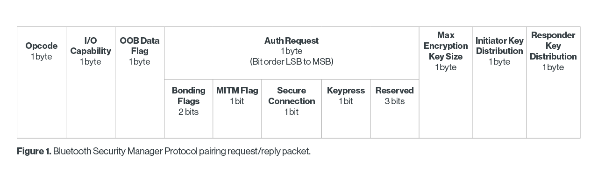

# Bluetooth Security

## Bluetooth Security Services

Bluetooth offers the following security services:

- **authentication**: to verify the identity of communicating devices
- **authorization**: allows the control of resources
- **confidentiality**: via encryption, provided in addition to frequency hopping

## Security Features

The Bluetooth security model includes five distinct security features:

- **pairing**: process of generating, distributing, and authenticating keys for encryption purposes
- **bonding**: the act of storing the keys created during pairing for use in future connections to form a trusted device pair
- **device authentication**: verification that the two devices have the same keys
- **encryption**: for message confidentiality
- **message integrity**: to protect against forgery

## Security Levels

- level 1: no security
- level 2: unauthenticated pairing with encryption (does not involve user interaction)
- level 3: authenticated pairing with encryption (involves user interaction)
- level 4: authenticated LE Secure Connections with encryption using 128-bit key (ECDH to protect pairing over insecure channel)

Level 4 is only available in BLE secure connections!

## Security Modes

- mode 1: levels without data signing (can be coupled with security levels 1 to 4)
- mode 2: levels with data signing, can be coupled with levels 2 and 3
- mode 3: securing data in broadcast communication

## Bluetooth Classic Security

### Legacy Pairing (BT Classic and BLE)

Authentication is based on a 4 or 6 digit PIN (can be brute forced). The PIN was used to derive the Link Key.

Keys are generated during pairing (PIN + Bluetooth addresses), with mechanisms based on the SAFER+ algorithm.

Encryption utilises the E0 algorithm (stream cipher) derived from the Massey-Rueppel algorithm.

There is no provision for cryptographic message integrity! While the CRC provides some integrity protection, it is not considered to provide cryptographic integrity, as it can be easily forged.

### Secure Simple Pairing (BT Classic only)

The primary goal of Secure Simple Pairing is to simplify the pairing procedure for the user, with the secondary goals to maintain or improve the security of Bluetooth wireless technology.

#### Authentication

Legacy pairing is vulnerable to playback attacks:

1. A has to authenticate to B, so B sends a nonce R to A
2. A must return R encrypted with shared secret key
3. If the key relies on a weak PIN, it can be brute-forced!

Solution: use public key cryptography (ECDH-192) in secure simple pairing.

#### MITM

Man-in-the-middle attacks are still possible. They occur when a user wants to connect two device but instead of connecting directly, they unknowingly connect to a third device (the attacker). The attacker can eavesdrop on the communications between the two devices, or inject commands.

1. T poses as A to B and as B to A
2. B tries to send A the nonce R, which gets intercepted by T
3. T encrypts R with their private key and sends the encrypted R to B
4. T forwards R to A
5. A encrypts R with their private key and sends the encrypted R to T
6. B asks T for the public key
7. T sends the public key, and B authenticates T as A
8. T asks A for the public key
9. A sends the public key to T
10. When B sends a message to A, T intercepts it, and decrypts the message
11. T then encrypts the message with A's public key and forwards it to A

Solution to MITM: solve a challenge that only A and B know, by exchanging an OOB secret.

#### Association models

SSP (but also Secure Connections) offers 4 association models:

- just works: no user interaction to connect, has 000000 as passcode by default (MITM possible)
- numeric comparison: user compares numbers displayes and confirms they're the same (prevents MITM)
- passkey entry: user reads 6-digit passcode from A and Enters the value in B, or user enters same 6-digit passcode in both A and B (prevents MITM)
- OOB: different Wireless protocol (e.g NFC) can be used to authenticate the communication(prevents MITM)

## BLE Security

### Security Manager Protocol

SMP is a peer-to-peer protocol used to generate encryption keys and identity keys. It operates over a dedicated L2CAP channel, and manages storage of encryption keys. It is also responsible for generating random addresses and resolving random addresses to known device identities.

### Secure Connections Pairing

Pairing with secure connections consists in three main phases:

1. select pairing method (LE legacy or secure connections)
2. (optional) authentication, key generation, link enccryption
3. key distribution: LTK (for link encryption), CSRK (for data signing), IRK (for BT privacy)

Secure connections uses elliptic curve public key cryptography to allow a symmetric key to be securely derived. That key is then used to encrypt the link during the key distribution phase.

#### Step 1: Feature Exchange

Pairing is performed to astablish keys, which can then be used to encrypt a link.

During feature exchange (done through pairing request and pairing response packets):

- security features are exchanged
- I/O capabilities (keyboard? screen?), requirements for MITM, OOB (NFC?), and others are included

#### Step 2: Pairing

Can use either LE legacy pairing or secure connections.

##### LE Legacy Pairing

Each device generates a temporary key TK (integer between 0 and 999999!), which only the user knows (shared secret, can be a passkey).

1. When TK value in ready, the initiating and responding device generate a 128-bit random number Mrand and Srand
2. Each computes a confirmation using TK, Mrand or Srand, pairing info, and addresses
3. Verify the devices own the TK by exchanging the confirmations, sharing Mrand and Srand, and recomputing the confirmations
4. Generate the short term key (STK) using AES128 on TK, Srand and Mrand

##### Secure Connections

If the AuthReq field has the SC bit set, then secrure connetions will be used.

Authentication is accomplished with ECDH.

1. Pairing is started by the initiating device sending its PKa to responding device. The responding device replies with its own PKb.
2. Each device selects a random 128-bit nonce. This value is used to prevent replay attacks.
3. The responding device then computes a commitment, Cb, which is calculated using Nb, PKa, PKb, and 0.
4. Cb is sent to initiating device.
5. Na is sent to responding device.
6. Nb is sent to initiating device. Initiating device checks Cb. A failure at this point indicates the presence of an attacker or other transmission error and should cause pairing process to abort.
7. If the commitment check succeeds, the two devices each compute six-digit confirmation values that are displayed to the user on their respective devices. The user is expected to check that these six-digit values match and to confirm if there is a match. If no match, pairing aborts.

#### Step 3: Key Computation

When authentication is successful, the two devices start to compute the LTK which will be used for link encryption.

#### Pairing, Bonding, and Keys

Pairing is for authentication, encryption, key distribution.

Bonding is for storing keys to avoid pairing each time.

Pairing keys:

- TK: used during the pairing procedure, a value determined by the pairing algorithm (always 0 in JW, 6 digit PIN in PKE, 128 bit in OOB)
- STK: used as the key for encrypting a connection the very first time two devices pair; computed with TK, Srand, Mrand

Bonding keys:

- LTK: distributed once the initial pairing procedure has encrypted the connection
- IRK: gives a device that knows a peer's device IRK the ability to resolve a peer device's identity
- CSRK: gives a receiving device the ability to resolve a signature and therefore authenticate the sender

### BLE Privacy

Goal: avoid the ability to track a LE device over a period of time.

How: change the device address on a frequent basis (use random addresses and rotate them frequently).

Must use a key to resolve the random addresses: IRK echanged during bonding.

#### Privacy Modes

There are two:

- **device privacy mode**:  It should accept advertising packets from peer devices that contain their Identity Addresses as well as their private address, even if the peer device has not distributed its IRK
- **network privacy mode**: it shall not accept advertising packets containing the Identity Address of peer devices that have not distributed their IRK

#### Device Addresses

- public: global and fixed, registered with IEEE
- random: no need to be registered
- static: randomly generated at each boot
- private: can be resolvable (privacy address, allows bonding, generated by IRK) or non-resolvable (does not allow bonding)

#### Resolvable Private Addresses

After pairing, during bonding phase the devices exchange and share keys.

The Identity Resolving Key (IRK) allows the device to sign the address so that only devices that knows the IRK can resolve the address.

Address generation:

- generate 22 bit random sequence Prand
- compute 24 bit hash using IRK: localhash = ah(IRK, Prand)
- share address = localhash || Prand || 10

Address verification:

- extract 22 bit Prand from address
- compute 24 bit hash using IRK: localhash = ah(IRK, Prand)
- compare localhash and hash

#### Confidentiality

There are three confidentiality modes:

- mode 1: no encryption
- mode 2: encrypt unicast data traffic only
- mode 3: encrypt all data traffic

## Bluetooth Vulnerabilities

### Denial of Service

Flood the victim with pairing requests!

### Bluejacking

Bluejacking is a Bluetooth attack in which a hacker spams your device with unsolicited phishing messages. These messages can contain malicious links.

### Bluesnarfing

Bluesnarfing is a Bluetooth security threat in which a hacker gains unauthorized access to your files using a Bluetooth connection.

### MITM

Problem: legacy authentication procedure provides unilateral authentication (SC provides mutual authentication).

Goal: downgrade to legacy pairing which only provides unilateral authentication.

### Relay

Relay attacks target the use of Bluetooth proximity to unlock a device.

1. Attacker 1 is in close proximity to the car and out of range of the authenticating phone
2. Attacker 2 is in close proximity to the legitimate phone used to unlock the device
3. Attacker 1 and 2 have an open Internet connection that allows them to exchange data
4. Attacker 1 uses a Bluetooth-enabled device to impersonate the authenticating phone and sends the victim device a signal
5. The device replies with an authentication request
6. Attacker 1 captures the request and sends it to Attacker 2
7. Attacker 2 forwards the request to the authenticating phone
8. The phone responds with a credential
9. Attacker 2 captures the credentials and relays back to Attacker 1
10. Attacker 1 sends the credential to the victim’s device

Solutions:

- measure latency
- disable key on phone when is stationary for more than 30 seconds
- ask for user interaction

### Bruteforcing TK Negotiation (Crackle Attack)

Legacy pairing is broken by design: confirmation is just AES(TK, AES(TK, rand XOR p1) XOR p2).
In Just Works, TK is 0; in passkey entry a number between 0 and 999999.

1. A pairs with B
2. T observes pairing and key exchange
3. T recovers the TK (just bruteforce it)
4. T recovers STK with TK and pairing data (rand, p1, p2)
5. T recovers LTK with STK and key exchange