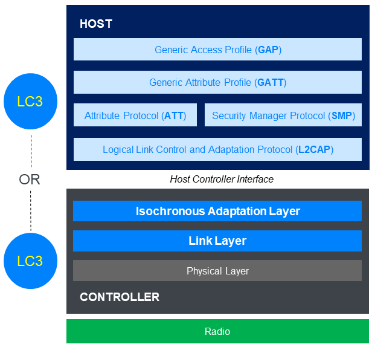
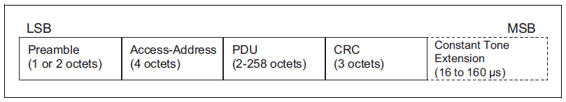
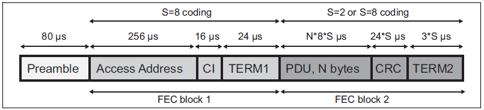
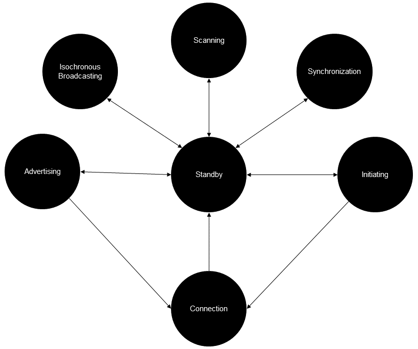

# Bluetooth Low Energy (LE)

The following is an exhaustive guide on how the Bluetooth Low Energy (LE) protocol works. Based on the [Bluetooth LE Primer](https://www.bluetooth.com/bluetooth-resources/the-bluetooth-low-energy-primer/).

## Bluetooth LE Specifications

There are two types of collections of specifications that define how products use Bluetooth:

- profiles: define the rules for using Bluetooth technology for a particular product or application type (specifications for how a device works in a particular application)
- services: contain state data relating to aspects of the device and support specified operations on that data (collection of related characteristics, which operate together to perform a particular function)

### Bluetooth Core Specification

The Bluetooth Core specification is the primary spedification for both Bluetooth LE and Bluetooth Classic. It defines the architecture of the technology and its layers, and defines all behaviours and capabilities of the Bluetooth stack. In summary, it defines how the Bluetooth technology works.

### Profile Specifications

Profile specifications define the roles that related devices assume. In particular, they define the behaviour of the client device and the data on the connected server that it should work with.

### Service Specifications

State data on servers resides in formally defined data items known as characteristics and descriptors. Profile specifications define the roles that related devices assume and in particular, define the behaviour of the client device and the data on the connected server that it should work with.

### Assigned Numbers

All services, characteristics and descriptors have a universally unique identifier (UUID) which identifies the type of the service, characteristic or descriptor to which it relates

## Bluetooth LE Stack

The Bluetooth LE stack consists of a number of layers and functional modules. These parts of the stack are distributed across two different major architectural blocks known as host and controller. The host and controller act as separate logical containers in the architecture.

The Host Controller Interface (HCI) indicates the logical interface between host and controller.

The Bluetooth LE stack spans all layers of the OSI model, as it is a full stack communication system.

Summary of Bluetooth LE layers:

- **physical layer**: defines all aspects of Bluetooth technology that are related to the use of radio (RF)
- **link layer**: defines air interface packet formats, bit stream processing procedures, protocols for over-the-air communication and link control
- **isochronous adaptation layer**: allows different frame durations to be used by devices using isochronous communication
- **host controller interface**: provides a functional interface for bi-directional communication between host and controller
- **logical link control and adaptation protocol**: acts as a protocol multiplexer within the host
- **security manager protocol**: protocol used during the executionof security procedures such as pairing
- **attribute protocol**: protocol used by an ATT client and an ATT server which allows the discovery and use of data in the server's attribute table
- **generic attribute profile**: defines high level data types known as services, characteristics and descriptors in terms of underlying attributes in the attribute table
- **generic access profile**: defines operational modes and procedures which may be used when in a non-connected state, security levels and models, and some user interface standards

## Physical Layer

### Frequency Band

Bluetooth LE operates in the 2.4GHz unlicensed band in the range 2400 MHz to 2483.5 MHz which is
divided into 40 channels, each with a spacing of 2 MHz.

### Modulation Scheme

To encode digital data from higher layers of the stack before transmission and to decode radio
signals received, Bluetooth LE uses a modulation scheme called Gaussian Frequency Shift Keying
(GFSK).

GFSK works by taking a signal with the central frequency of the selected channel (the carrier)
and shifting it up by a specified amount to represent a digital value of 1 or down by the same
amount to represent a binary value of 0. Gaussian filtering is applied to the signal to reduce noise. [Gaussian filtering](https://en.wikipedia.org/wiki/Gaussian_filter) is then applied to the signal to reduce noise.

### PHY Variants

The Bluetooth specification defines three modulation schemes. Each scheme is referred to as PHY and has a name:

- LE 1M PHY uses a symbol rate of 1 Msym/s
- LE 2M PHY uses a symbol rate of 2 Msym/s
- LE Coded PHY uses a symbol rate of 1 Msym/s and packets are subject to Forward Error Correction

### Time Division

A Bluetooth LE radio is a half-duplex device, capable of transmitting and/or receiving but not both at the same time. However all PHYs are used in a Time Division Duplex (TDD) scheme so that the appearance of a full-duplex radio is given.

### Transmission Power and Receiver Sensitivity

The output power level at the maximum power setting can be between 0.01 mW (-20 dBm) and 100 mW (+20 dBm).

### Antenna Switching

Bluetooth LE supports two methods of calculating the direction from which a received signal was
transmitted:

- Angle of Arrival (AoA)
- Angle of Departure (AoD)

## Link Layer

### Packets

The Link Layer defines two packet types. The following packet is used by the uncoded PHYs:

While the following is used by the Coded PHY:

- **preamble**: allows the receiver to synchronize precisely on the frequency of the signal, perform automatic gain control and estimate the symbol timing
- **access address**: used by receivers to differentiate signals from background noise and to determine the relevance or otherwise of a packet to the receiving device
- **CRC**: used for error detection
- **PDU**: may contain a variety of different Protocol Data Units (PDUs) depending on how Bluetooth LE is being used
- **CTE**: only present when one of the two direction finding methods (Angle of Arrival or Angle of Departure) is in use

### State Machine

The link layer is defined by a state machine:

- **standby**: neither transmitting nor receiveing packets
- **initiating**: responds to advertising packets from a particular device to request a connection
- **advertising**: transmits advertising packets and potentially processes packets sent in response to advertising paclets by other devices
- **connection**: in a connection with another device
- **scanning**: listening for advertising packets from other devices
- **isochronous broadcast**: broadcasts isochronous data packets
- **synchronization**: listens for periodic advertising belonging to a speficic advertising train transmitted by a particular device

Two important roles are defined during the connection state:

- **central role**: a device which initiates a connection and transitions from the initiating state to the connection state assumes this role
- **peripheral role**: a device which accepts a connection request, transitioning from the advertising state to the connection state assumes this role

### Channel Selection

Bluetooth LE uses spread spectrum techniques in various different ways to communicate data via multiple channels over the course of time. This reduces the chances of collisions, making communication more reliable. One such technique is that of asaptive frequency hopping. This involves the radio channels used for packet communication changing at regular intervals.

### Data Transport Architecture

The architecture section of the Bluetooth Core Specification defines a number of concepts which collectively constitute the Bluetooth data transport architecture. Key amongst these concepts are the Physical Channel, Physical Link, Logical Link and Logical Transport.

### Logical Transports

Logical transports define how data is carried over the air in Bluetooth LE.

| Logical Transport | Full Name                               | Purpose                             | Typical Use Case                |
| ----------------- | --------------------------------------- | ----------------------------------- | ------------------------------- |
| **LE-ACL**        | LE Asynchronous Connection-Less         | Bidirectional, reliable connections | Data exchange between devices   |
| **LE-ADVB**       | LE Advertising Broadcast                | One-to-many broadcasting            | Advertising, discovery          |
| **LE-PADVB**      | Periodic Advertising Broadcast          | Synchronized broadcast              | Connectionless sensors, beacons |
| **LE-PAwR**       | Periodic Advertising with Responses     | Scheduled two-way broadcast         | Very-low-power sensor networks  |
| **LE-CIS/BIS**    | Connected/ Broadcast Isochronous Stream | Time-synchronized streaming (audio) | Audio over BLE (LE Audio)       |

## Isochronous Adaptation Layer

The Isochronous Adaptation Layer (IAL) is a layer between the application (like an audio codec) and the BLE isochronous transport (CIS/BIS). It is responsible for framing application data into isochronous packets, managing timing and reliability constraints, protecting against packet loss and mapping high level data to Bluetooth LE transport payloads.

## Host Controller Interface

The HCI defines a standardized interface via which a host can issue commands to the controller and a controller can communicate with the host. It is used by both Bluetooth LE and Bluetooth BR/EDR.

### HCI Functional Specification

The functional interface is defined in terms of commands and events, messages which may be exchanged between host (software stack: L2CAP, ATT, GATT, ...) and controller (radio, PHY, Link Layer):

- **commands**: sent by the host to the controller
- **events**: sent by the controller to the host, may be the response to a command or an unsolicited message

### HCI Transports

| HCI Transport            | Medium          | Packet Framing    | Use Case                                    |
| ------------------------ | --------------- | ----------------- | ------------------------------------------- |
| **UART (H4)**            | Serial (TX/RX)  | Yes (H4 types)    | Embedded MCUs, Raspberry Pi, Android SoCs   |
| **USB**                  | USB 2.0/3.0     | No (native USB)   | PC dongles, laptops, dev boards             |
| **SDIO**                 | SD card bus     | Yes               | Smartphones/tablets, combo wireless chips   |
| **Three-wire UART (H5)** | Serial (3-wire) | Yes (H5 protocol) | Reliable embedded links, Linux/BlueZ setups |

## The Logical Link Control and Adaptation Protocol

The Logical Link Control and Adaptation Protocol (L2CAP) is responsible for protocol multiplexing, flow control, and segmentation and reassembly of service data units (SDUs).

### L2CAP and Protocol Multiplexing

Sitting above L2CAP in the stack are layers which use distinct protocols such as the attribute protocol (ATT) and the security manager protocol (SMP). L2CAP protocol multiplexing makes sure that SDUs get passed up the stack into the appropriate layer for processing.

### L2Cap and Flow Control

Flow control is concerned with making sure that the rate at which packets are produced by one layer of a stack does not exceed the rate at which a layer in the same stack or on a remote device processes those packets.

### L2CAP Segmentation and Reassembly

Layers both above and below L2CAP are subject to a Maximum Transmission Unit (MTU) size which specifies the largest size a PDU of the type created by that layer is allowed to be.

L2CAP itself and the layers above or below it in the stack may have different MTU sizes and consequently, it may be necessary to split some PDUs/SDUs into a series of smaller parts which the adjacent layer can handle or conversely, to reassemble a series of related, smaller parts into full PDUs/SDUs. Those processes, as applied by L2CAP with respect to upper layers is called segmentation and reassembly while the equivalent processes as they relate to L2CAP and its relationship with lower layers is called fragmentation and recombination.

## Attribute Protocol

The attribute protocol (ATT) is used by two devices:

- client
- server

The server exposes a series of composite data items known as attributes, which are organized in an indexed list called attribute table.

Each attribute contains a handle, a UUID, a value and a set of permissions.

ATT is used by the ATT client to discover details of the attribute table in an ATT server, including the handle values of attributes or attribute types of interest. When handle values are known, they can be used with some PDU types to identify and then act upon specific attributes in the table.

ATT is one of the primary mechanisms by which applications in connected BT LE devices interact with each other, using PDUs that the protocol defines, and procedures defined in higher level specifications, such as the Generic Attribute Profile (GATT).

ATT may be used by both Bluetooth LE or Bluetooth BR/EDR.

### ATT PDUs

The Attribute Protocol defines 31 distinct PDUs each of which are based upon one of six broad methods:

- **commands**: sent by a client to a server with no response from the server invoked
- **requests and responses**: requests are sent by a client to a server; the server is expected to reply with a response PDU of a corresponding type or an error message within 30 seconds
- **notifications**: are unsolicited PDUs that are sent by a server to a client
- **indications and confirmations**: sent by a server to a client; client is expecred to reply with a confirmation PDU or with an error response within 30 seconds

All ATT PDUs have the same structure, consisting of an opcode which identifies the PDU type, a set of parameters and an optional authentication signature.

The maximum length of an ATT PDU depends on the Maximum Transmission Unit (MTU) value that has been established.

### Transactions

Each request/response pair or indication/confirmation pair forms a transaction. If a transaction times out then it is regarded as to have failed and no further PDUs of any type may be sent using the current bearer.

### Bearers

ATT is handled by the L2CAP layer beneath in one of two ways, each known as a bearer:

- **unenhanced bearer**
- **enhanced bearer**

### Discovering support for EATT

EATT is an upgraded version of the Attribute Protocol (ATT) that enables multiple simultaneous transactions over separate logical channels, reducing latency and preventing blocking issues in BLE communication.

The defined Generic Attribute Profile service allows a client to determine whether or not a connected server supports EATT and conversely, to allow the client to inform the server that it supports EATT.

## The Generic Attribute Profile

The Generic Attribute Profile (GATT) defines higher level data types based on the attributes held in the attribute table. Those data types are called services, characteristics and descriptors. It also defines a series of procedures involved in using these data types via the Attribute Protocol (ATT).
